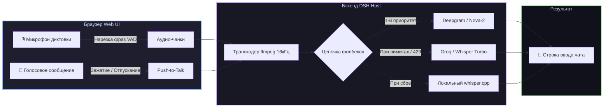

# 📦 @goodandready/dsh-voice

<div align="center">

<h3>Потоковая диктовка без задержек и мультиязычный голосовой ввод для DeepSeek Harness</h3>

<p align="center">
  <a href="https://www.npmjs.com/package/@goodandready/dsh-voice"></a>
  <a href="LICENSE"></a>
  <a href="https://github.com/topics/dsh-plugin"></a>
  <a href="https://nodejs.org"></a>
</p>

<p align="center">
  <a href="https://goodandready.app/"></a>
</p>

<p align="center">
  <a href="README.md"><b>🇬🇧 English</b></a> •
  <a href="README.ru.md"><b>🇷🇺 Русский</b></a> •
  <a href="README.zh.md"><b>🇨🇳 中文说明</b></a>
</p>

</div>

---

## ⚡ Обзор

**`dsh-voice`** добавляет полноценные голосовые возможности в веб-интерфейс **DeepSeek Harness**. Будь то непрерывная диктовка с нарезкой фраз по естественным паузам или голосовые сообщения с удобными жестами Push-to-Talk (мышь и клавиатура) — `dsh-voice` гарантирует сохранность каждой записи благодаря **автоматическим цепочкам отказоустойчивости**.



---

## ✨ Ключевые возможности

* 🎙️ **Потоковая диктовка с VAD**: аудиопоток режется по естественным паузам речи (`vadSilenceMs`, по умолчанию 700 мс) и мгновенно печатается в поле ввода.
* 🌊 **Голосовые заметки с окном отмены**: запишите законченную мысль — сообщение автоматически уйдёт агенту по истечении таймера (`autoSendMs`, по умолчанию 4000 мс).
* 🎮 **Тактильный Push-to-Talk**:
  * **Мышь**: зажмите кнопку волны — запись идёт пока кнопка зажата; отпускание отправляет, увод курсора отменяет запись.
  * **Клавиатура**: зажмите <kbd>Ctrl</kbd> для записи без мыши; нажмите <kbd>Esc</kbd> для отмены.
* ⚡ **Субтитры браузера в реальном времени (`browser`)**: локальное распознавание Chrome Web Speech API без отправки звука на сервер с плавающими субтитрами.
* 🛡️ **Надёжные цепочки фолбеков**: при исчерпании квоты или ошибке 429 плагин мгновенно обращается к следующему провайдеру в списке.
* 🧠 **Контекстный словарь (Context Glossary)**: автоматическое извлечение переменных и технических терминов из черновика композера для точного распознавания редких слов и кода.
* 🎵 **Встроенный аудиоплеер**: предпросмотр и воспроизведение записанного голосового сообщения в чате и доке перед отправкой или для переслушивания.
* 🔇 **Аппаратное шумоподавление**: переключатель в настройках для включения/выключения браузерного шумоподавления, эхоподавления и АРУ.
* 📊 **Дашборд задержки и здоровья провайдеров**: мониторинг скорости ответа (мс), процента успешных транскрипций и ошибок в реальном времени.
* 🔒 **Безопасность API-ключей**: ключи читаются на сервере через `ctx.credentials` и никогда не попадают в браузер клиента.
* 🖥️ **Автозапуск локального whisper.cpp**: управление жизненным циклом `whisper-server` с авто-конвертацией через `ffmpeg`.
* ⚡ **SenseVoice-ONNX / Sherpa-ONNX** *(0.8.11)*: сверхбыстрый (~50–100мс) неавторегрессивный локальный STT с автоматической очисткой тегов эмоций/событий. Поддержка Sherpa-ONNX HTTP и OpenAI-совместимых эндпоинтов.
* 🌐 **Потоковое аудио в реальном времени** *(0.8.11)*: низколатентный WebSocket-мост (`/dsh-voice/realtime`) для OpenAI Realtime API или локального Sherpa-ONNX. API-ключи остаются на хосте.
* 🌊 **Анимированные визуализаторы Liquid Wave и Dynamic Orb** *(0.8.12)*: живая интерактивная анимация звуковой волны в полоске записи с откликом на громкость микрофона. Выбор стиля: текучая волна, пульсирующая сфера, классические столбики или выключен.

---

## 🎮 4 способа голосового ввода

| Режим | Жест / Активация | Поведение |
|---|---|---|
| **Диктовка** | Клик <kbd>🎙️ Микрофон</kbd> | Речь режется по паузам (`vadSilenceMs`) и вставляется прямо в строку ввода |
| **Голосовое сообщение** | Клик <kbd>🌊 Волна</kbd> | Запись до нажатия стоп, затем отправка с окном отмены (`autoSendMs`) |
| **PTT Мышью** | Зажатие <kbd>🌊 Волна</kbd> | Запись пока зажата кнопка; отпускание отправляет, увод мыши сбрасывает |
| **PTT Клавиатурой** | Зажатие <kbd>Ctrl</kbd> | Запись без мыши; отпускание отправляет, нажатие <kbd>Esc</kbd> отменяет |

> [!TIP]
> Клавиатурную клавишу можно легко переопределить в настройках (`hotkey`: `Control`, `Alt`, `Shift` или любой код клавиши).

---

## 🛠️ Матрица поддерживаемых провайдеров

| Ключ | Сервис | Модель по умолчанию | Переменная секрета | Особенности |
|---|---|---|---|---|
| `browser` | Web Speech API | Нативная в браузере | *Не требуется* | Нулевая задержка, живые субтитры в Chrome |
| `deepgram` | Deepgram API | `nova-2` | `DEEPGRAM_API_KEY` | Сверхбыстрая облачная транскрипция |
| `groq` | Groq Whisper | `whisper-large-v3-turbo` | `GROQ_API_KEY` | Мгновенная скорость генерации |
| `hf` | HuggingFace Inference | `openai/whisper-large-v3` | `HF_TOKEN` | Высокоточный облачный Whisper |
| `local-whisper` | Локальный whisper.cpp | из параметров сервера | *Не требуется* | 100% приватность, оффлайн, без интернета |
| `sensevoice` | SenseVoice-ONNX / Sherpa-ONNX | `SenseVoiceSmall` | *Не требуется* | Сверхбыстрый (~50мс) локальный неавторегрессивный STT |

### 🚀 Готовые пресеты (Plug & Play)

Достаточно указать имя в цепочке и добавить API-ключ:
* `openai` (`whisper-1`) → `OPENAI_API_KEY`
* `siliconflow` (`SenseVoiceSmall`) → `SILICONFLOW_API_KEY`
* `mistral` (`voxtral-mini-latest`) → `MISTRAL_API_KEY`
* `openrouter` (`google/gemini-2.5-flash`) → `OPENROUTER_API_KEY`
* `deepinfra` (`whisper-large-v3-turbo`) → `DEEPINFRA_API_KEY`
* `fireworks` (`whisper-v3-turbo`) → `FIREWORKS_API_KEY`

---

## 📦 Быстрая установка

```bash
dsh plugin --profile web add @goodandready/dsh-voice
```

> [!IMPORTANT]
> Перезапустите Web UI после установки (`systemctl --user restart dsh-web`) и обновите страницу в браузере.

---

## ⚙️ Настройка конфигурации

Откройте **Настройки → Плагины → Настройки плагинов → Голос** в Web UI:

```yaml
- id: dsh-voice
  config:
    dictation:
      language: ru
      vadSilenceMs: 700
      chain:
        - provider: deepgram
        - provider: groq
        - provider: local-whisper
    message:
      language: ru
      autoSendMs: 4000
      chain:
        - provider: openai
        - provider: local-whisper
    hotkey: Control
    autoStart: true
    whisperModel: /models/ggml-medium-q8_0.bin
```

---

## 🤖 Инструмент агента и HTTP API

### Инструмент агента (`transcribe_audio`)
Регистрирует `transcribe_audio(file_path, language?)` в `ctx.tools`, позволяя агентам распознавать аудиофайлы, интервью и записи с диска.

### Внутренние HTTP эндпоинты
* `POST /dsh-voice/transcribe` — `{ dataBase64, mimeType, mode }` → `{ ok, text, provider, tookMs }`
* `POST /dsh-voice/polish` — `{ text }` → `{ ok, text }`
* `GET /dsh-voice/status` — состояние демонов, цепочки, конфигурация SenseVoice и реалтайма.
* `GET /dsh-voice/realtime` — **WebSocket upgrade** для низколатентного аудио-стриминга (OpenAI Realtime API / Sherpa-ONNX). Принимает бинарные аудио-чанки, возвращает JSON-дельты текста.

---

## 📄 Лицензия

MIT © [GooDAnDReaDY](https://github.com/GooDAnDReaDY)
