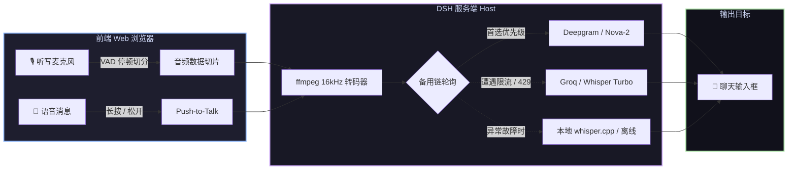

# 📦 @goodandready/dsh-voice

<div align="center">

<h3>DeepSeek Harness 零延迟流式语音听写与多服务商对讲输入插件</h3>

<p align="center">
  <a href="https://www.npmjs.com/package/@goodandready/dsh-voice"></a>
  <a href="LICENSE"></a>
  <a href="https://github.com/topics/dsh-plugin"></a>
  <a href="https://nodejs.org"></a>
</p>

<p align="center">
  <a href="https://goodandready.app/"></a>
</p>

<p align="center">
  <a href="README.md"><b>🇬🇧 English</b></a> •
  <a href="README.ru.md"><b>🇷🇺 Русский</b></a> •
  <a href="README.zh.md"><b>🇨🇳 中文说明</b></a>
</p>

</div>

---

## ⚡ 插件概览

**`dsh-voice`** 为 **DeepSeek Harness** Web 界面带来极速语音交互体验。无论是按自然停顿切分的流式听写，还是带撤回保护的语音消息以及键盘/鼠标 Push-to-Talk 对讲，`dsh-voice` 凭借**多服务商自动故障转移备用链**确保您的录音万无一失。



---

## ✨ 核心亮点

* 🎙️ **VAD 智能流式听写**：说话停顿自动切句（`vadSilenceMs`，默认 700ms），文字实时追加至输入框。
* 🌊 **带撤回窗口的语音消息**：录制完整语音，转写后在倒计时（`autoSendMs`，默认 4000ms）结束后自动发送。
* 🎮 **沉浸式 Push-to-Talk 对讲**：
  * **鼠标操作**：按住声波按钮开始录音，松开发送，拖离按钮取消。
  * **键盘操作**：按住 <kbd>Ctrl</kbd> 无需鼠标即刻说话，按 <kbd>Esc</kbd> 放弃本次录音。
* ⚡ **浏览器本地零延迟同声字幕 (`browser`)**：Chrome Web Speech API 本地离线解析，说话同时浮动显示实时字幕。
* 🛡️ **多服务商自动容灾切换**：首选 API 额度耗尽或遭遇 429 限流时，毫秒级顺位切换备用引擎。
* 🧠 **上下文术语注入 (Context Glossary)**：自动从输入草稿中提取代码变量名与专业术语，引导 STT 模型精准转写专业词汇。
* 🎵 **内嵌音频播放器**：在输入框与录音浮层中随时试听和回放刚刚录制的原始音频片段。
* 🔇 **硬件降噪切换开关**：在插件设置中自由开关浏览器级降噪、回声消除与自动增益控制。
* 📊 **服务商延迟与健康监控看板**：在设置界面实时掌握每个语音引擎的延迟（毫秒）、成功率与调用状态。
* 🔒 **API 密钥安全隔离**：密钥由服务端 `ctx.credentials` 统一解析，绝不向浏览器前端泄漏。
* 🖥️ **本地 whisper.cpp 服务端直连**：自动管理 `whisper-server` 进程，结合 `ffmpeg` 实现实时音频转码。

---

## 🎮 四种语音输入方式

| 交互模式 | 触发手势 | 行为效果 |
|---|---|---|
| **流式听写** | 单击 <kbd>🎙️ 麦克风</kbd> | 按停顿切分语音 (`vadSilenceMs`)，文本实时录入输入框 |
| **语音消息** | 单击 <kbd>🌊 声波</kbd> | 持续录音至手动停止，转写后进入撤回倒计时 (`autoSendMs`) |
| **鼠标对讲** | 长按 <kbd>🌊 声波</kbd> | 按住录音；松开发送，光标拖出按钮区域取消 |
| **键盘对讲** | 按住 <kbd>Ctrl</kbd> | 免鼠标快捷 Push-to-Talk 录音；按 <kbd>Esc</kbd> 取消 |

---

## 🛠️ 服务商矩阵

| 服务商标识 | 对应引擎 | 默认模型 | 环境变量凭据 | 特性说明 |
|---|---|---|---|---|
| `browser` | Web Speech API | 浏览器原生引擎 | *无需密钥* | 零延迟同声字幕输出 |
| `deepgram` | Deepgram API | `nova-2` | `DEEPGRAM_API_KEY` | 极速高精云端转写 |
| `groq` | Groq Whisper | `whisper-large-v3-turbo` | `GROQ_API_KEY` | 毫秒级极速推理 |
| `hf` | HuggingFace Inference | `openai/whisper-large-v3` | `HF_TOKEN` | 经典高精度开源模型 |
| `local-whisper` | 本地 whisper.cpp | 启动参数指定 | *无需密钥* | 100% 离线私密运行 |

---

## 📦 安装指南

```bash
dsh plugin --profile web add @goodandready/dsh-voice
```

---

## 📄 开源协议

MIT © [GooDAnDReaDY](https://github.com/GooDAnDReaDY)
